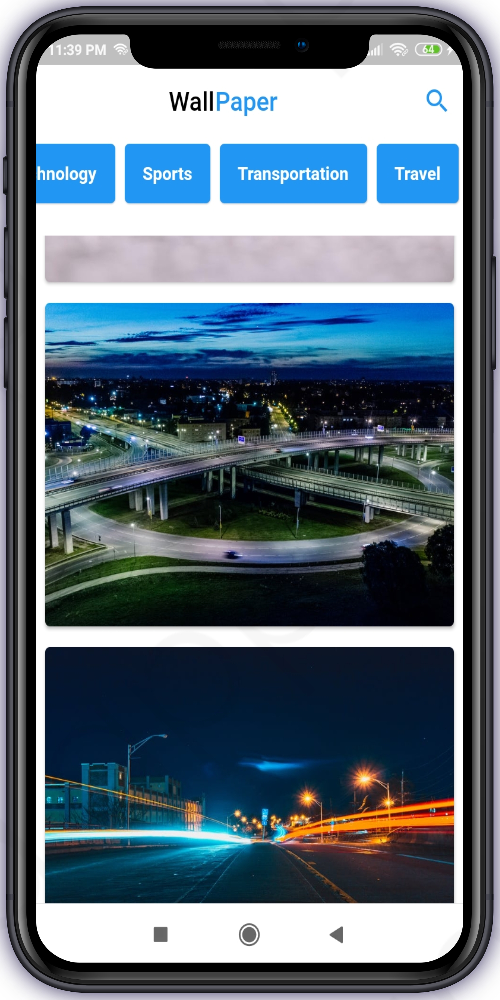
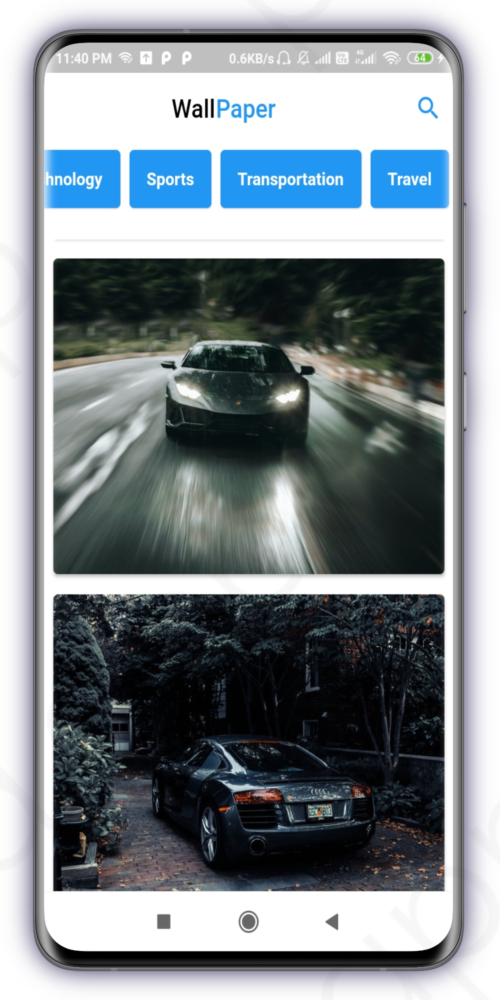
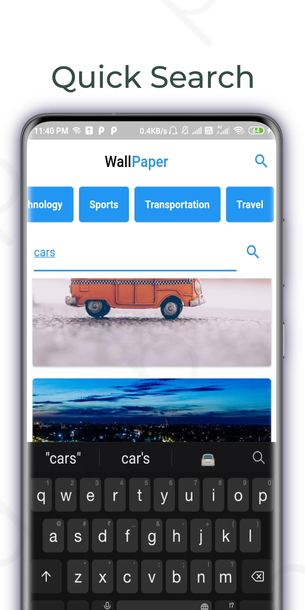

# wall_paper_app

Flutter based Wallpaper Application. You can contribute by opening a new issue and PR.

## Screenshots

&nbsp;&nbsp;&nbsp;&nbsp;&nbsp;

  

## Getting Started

1. First thing first clone the repo and run
   > flutter pub get
2. Checkout [Pexels.com](https://www.pexels.com/api/?locale=en-US) and get your key.
3. Paste that key inside lib/keys/key.dart
4. Run the project.

## Note

This repository is now open for hacktoberfest.
Drop a star if you like the Application.